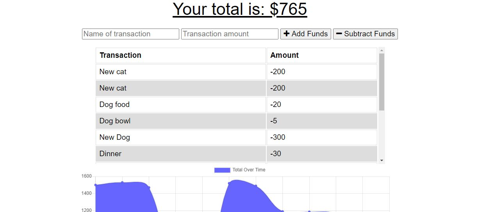
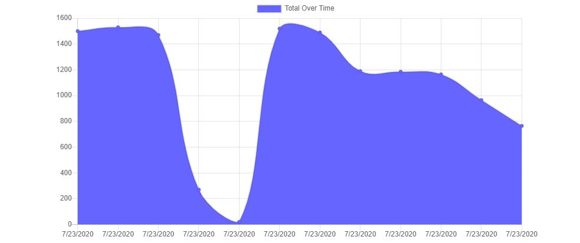

# Online/Offline Budget Tracker

## Description

Giving users a fast and easy way to track their money is important, but allowing them to access that information anytime is even more important. Having offline functionality is paramount to our applications success.

The user will be able to add expenses and deposits to their budget with or without a connection. When entering transactions offline, they should populate the total when brought back online.

Offline Functionality:

  * Enter deposits offline

  * Enter expenses offline

When brought back online:

  * Offline entries should be added to tracker.

## Table of Contents
* [Usage](#usage)
* [Finished Product](#finished-product)
* [Technologies](#technologies)
* [Questions](#questions)

## Usage
Visit the deployed Heroku link here: https://budget-tracker-ausley.herokuapp.com/ 

Then, insert the name and amount of your transaction, and select whether or not it will add or subtract from your funds. For example, if you were paid today, you would add that value to your funds. 

A chart will render your transactions below.

While offline you may continue to view the application and add transactions.

When internet is detected, your total budget will update based on those transactions.

You can also run "npm i" in your terminal, and once it has finished installing, run "node server.js"

## Finished Product
View the deployed application via Heroku here: https://budget-tracker-ausley.herokuapp.com/

View a brief demo of the application here: https://youtu.be/O24Xutr0-Pc 

## Technologies
* HTML
* CSS
* JavaScript
* Node.js
* Express.js
* MongoDB
* Mongoose
* IndexedDB
* Service Workers
* Cache API

## Questions
​
If you have any questions about the repo, please contact me:

On GitHub: [cmausley](https://github.com/cmausley) | Via Email: christinamausley@gmail.com